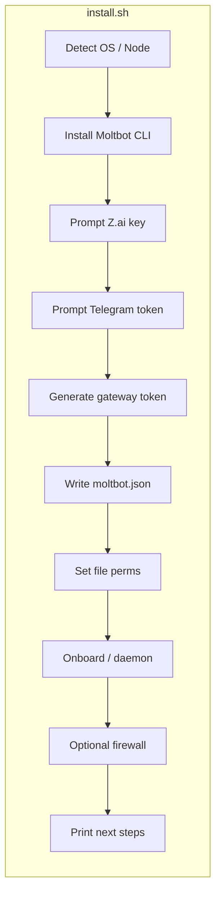

# Clawdbot VPS Install Script

## Goal

One executable shell script that:

1. Installs Moltbot (clawdbot) on a Linux VPS
2. Prompts interactively for **Z.ai API key** and **Telegram** bot token
3. Configures the gateway for **loopback-only** binding so nothing is reachable from outside (no `0.0.0.0`, no public ports)
4. Optionally hardens the system (firewall, permissions)

References: [Moltbot docs](https://docs.molt.bot/), [Z.ai provider](https://docs.molt.bot/providers/zai), [Telegram channel](https://docs.molt.bot/channels/telegram), [Gateway security](https://docs.molt.bot/gateway/security), [Hetzner/VPS](https://docs.molt.bot/platforms/hetzner).

---

## Architecture (script flow)

- **Config location:** `~/.clawdbot/moltbot.json` (or `$CLAWDBOT_STATE_DIR` if set).
- **Gateway:** Bind `loopback` only (default), port `18789`; auth via generated token. No LAN/public bind.
- **Access:** Dashboard only via SSH tunnel from user’s machine (e.g. `ssh -L 18789:127.0.0.1:18789 user@vps`).

---

## Implementation Plan

### 1. Script location and format

- **File:** Single script, e.g. `install-clawdbot-vps.sh`, in repo root ([clawd-script](https://github.com/clawd-script) is currently empty).
- **Shebang:** `#!/usr/bin/env bash`; `set -e` (or equivalent) for fail-fast.
- **Usage:** Document as one-liner: `curl -fsSL https://raw.githubusercontent.com/.../install-clawdbot-vps.sh | bash` or `bash install-clawdbot-vps.sh`.

### 2. Prerequisites and Moltbot install

- **Node:** Require Node ≥ 22. If missing, install via NodeSource (Debian/Ubuntu) or fail with clear message.
- **Moltbot:** Use official installer for consistency:
  - `curl -fsSL https://molt.bot/install.sh | bash -s --`
  - For non-interactive: pass `--no-prompt` and `--install-method npm` (see [Installer](https://docs.molt.bot/install/installer)) so the script does not hang.
- **Directory:** Ensure `~/.clawdbot` exists (and optionally `~/clawd` for workspace).

### 3. Interactive prompts

- **Z.ai API key**
  - Prompt: e.g. “Enter your Z.ai API key (from Z.AI console):”
  - Use `read -s` (or equivalent) so the key is not echoed.
  - Validate non-empty; re-prompt or exit with message if empty.
- **Telegram**
  - Prompt: “Enter your Telegram bot token (from @BotFather):”
  - Same treatment (read securely, non-empty).
  - Optional: Short note in script comments or echo: “Create a bot with @BotFather, then paste the token here.”

No other interactive prompts required for a minimal VPS path (e.g. skip WhatsApp/Discord unless you add optional “add more channels later” message).

### 4. Gateway token and config generation

- **Gateway token:** Generate once, e.g. `openssl rand -hex 32` (or `head -c 32 /dev/urandom | xxd -p` if no OpenSSL).
- **Config content (JSON):**
  - **Gateway (VPS lock-down):**
    - `gateway.bind`: `"loopback"` (only `127.0.0.1`).
    - `gateway.port`: `18789`.
    - `gateway.auth.mode`: `"token"`.
    - `gateway.auth.token`: generated token above.
    - Do **not** set `gateway.bind` to `lan` or any value that listens on `0.0.0.0`.
  - **Discovery (optional hardening):** `discovery.mdns.mode`: `"off"` or `"minimal"` to avoid broadcasting details on the network.
  - **Z.ai:**  
    - `env.ZAI_API_KEY`: value from prompt (or write to `~/.clawdbot/.env` and reference in config if you prefer not to store key in JSON).  
    - `agents.defaults.model.primary`: `"zai/glm-4.7"`.  
    - Include `agents.defaults.models["zai/glm-4.7"]`: `{}` if the schema requires it (see [Z.ai](https://docs.molt.bot/providers/zai)).
  - **Telegram:**  
    - `channels.telegram.enabled`: `true`.  
    - `channels.telegram.botToken`: token from prompt.  
    - `channels.telegram.dmPolicy`: `"pairing"`.  
    - `channels.telegram.groups`: `{ "*": { "requireMention": true } }` so groups are mention-only.
  - **Security baseline:**  
    - `channels.telegram.dmPolicy`: `"pairing"` (already above).  
    - No `allowFrom: ["*"]`; keep group policy strict.

Config file format: **JSON5** is supported by Moltbot; for maximum compatibility with `jq` or minimal deps, plain JSON is fine (no comments). Write to `~/.clawdbot/moltbot.json` (or `$CLAWDBOT_CONFIG_PATH` if you want to support overrides).

### 5. Secrets storage and permissions

- **Permissions (security):**
  - `chmod 700 ~/.clawdbot`
  - `chmod 600 ~/.clawdbot/moltbot.json`
- **Secrets:** Prefer not to log or echo the Z.ai key or Telegram token; avoid storing them in world-readable locations. If you write a `.env`, restrict to the same user (e.g. `600`).

### 6. Onboarding and daemon

- **Option A (recommended):** After writing config, run:
  - `moltbot doctor --non-interactive` (fix perms / sanity).
  - Then install the gateway service so it starts on boot:
    - Linux (systemd): Moltbot’s `moltbot onboard --install-daemon` typically sets up a user service; run it and ensure it does not overwrite our config. If the wizard is interactive, use env vars so it picks existing config: e.g. `ZAI_API_KEY`, `TELEGRAM_BOT_TOKEN`, and `CLAWDBOT_GATEWAY_TOKEN` set, and pass any non-interactive flags the installer supports.
  - If `onboard` always runs a full wizard and overwrites config, then only run the daemon-install step if there is a separate command (e.g. “install service only”); otherwise document “start gateway manually” and provide a systemd unit snippet in the script or in a comment.
- **Option B:** Do not run full onboard; only run `moltbot doctor --non-interactive`, then start gateway once with `moltbot gateway --port 18789` and tell the user to set up their own systemd unit (script can print a minimal unit file to a path like `~/.config/systemd/user/moltbot-gateway.service`).

Recommendation: Implement Option A and, in the script, **write config first**, then run `moltbot onboard --install-daemon` with environment variables set (`ZAI_API_KEY`, `TELEGRAM_BOT_TOKEN`, `CLAWDBOT_GATEWAY_TOKEN`) and `--no-prompt` / `--install-method` if available, so the wizard skips or reuses our values and does not overwrite `gateway.bind` or auth. If the wizard overwrites, add a final “patch” step that re-applies `gateway.bind: "loopback"` and `gateway.auth.token` from the script (e.g. using `jq` or a small inline script).

### 7. Firewall and server hardening (recommended for VPS)

- **Firewall (ufw):** If `ufw` is present: enable it, allow SSH (e.g. 22), default deny incoming. Do **not** allow 18789 from outside; gateway is loopback-only.
- **Non-root (when script runs as root):** Create dedicated user `clawdbot`, create `~clawdbot/.clawdbot` and `~clawdbot/clawd`, write config and run gateway/daemon as that user.
- **fail2ban (optional):** Install fail2ban, enable `sshd` jail; support `--no-fail2ban` to skip.
- **Message:** “Firewall enabled; gateway is only reachable via SSH tunnel.”

### 8. Next steps printed at the end

- “Gateway is bound to 127.0.0.1 only. To use the dashboard from your laptop:”
  - `ssh -N -L 18789:127.0.0.1:18789 user@YOUR_VPS_IP`
  - Then open `http://127.0.0.1:18789/` and paste the gateway token (print the token once, or say “your gateway token was printed earlier”).
- “Telegram: First DM will show a pairing code; approve with:”
  - `moltbot pairing list telegram`
  - `moltbot pairing approve telegram <CODE>`
- “Z.ai model: primary model is zai/glm-4.7 (see docs.molt.bot/providers/zai).”

---

## File to add

| File                                               | Purpose                                                                                                                                                                                 |
| -------------------------------------------------- | --------------------------------------------------------------------------------------------------------------------------------------------------------------------------------------- |
| [install-clawdbot-vps.sh](install-clawdbot-vps.sh) | Single install script: Node/moltbot install, prompts for Z.ai + Telegram, write `moltbot.json` (loopback, token auth, Z.ai, Telegram), perms, onboard/daemon, optional ufw, next steps. |

---

## DigitalOcean-inspired hardening (what we can implement)

| DO pillar                         | What DO does                                                                         | What we implement                                                                                                                                                                                                                                                                                                                                                                                              |
| --------------------------------- | ------------------------------------------------------------------------------------ | -------------------------------------------------------------------------------------------------------------------------------------------------------------------------------------------------------------------------------------------------------------------------------------------------------------------------------------------------------------------------------------------------------------- |
| **Container-based isolation**     | Moltbot runs in Docker; agent crash/misbehave only affects container, not host.      | **Optional Docker path:** Offer a second install mode: run Moltbot in a dedicated Docker container (see [Hetzner/Docker](https://docs.molt.bot/platforms/hetzner)). Script creates `docker-compose.yml` + `.env`, mounts `~/.clawdbot` and `~/clawd`, binds gateway to `127.0.0.1:18789` only and maps from host loopback. Agent/tool execution stays inside the container; host and credentials are isolated. |
| **Authentication by default**     | Unique gateway token per deployment; only authorized clients can talk to the agent.  | **Already in plan:** Generate unique token and set `gateway.auth.mode: "token"`. Ensure token is printed once or saved to a file for Control UI over SSH tunnel.                                                                                                                                                                                                                                               |
| **Hardened server configuration** | Firewall, non-root execution, locked-down permissions, fail2ban for abusive traffic. | **Implement:** (1) Firewall: ufw, allow SSH only, default deny. (2) Non-root: Create user `clawdbot`, run gateway/Docker as that user; if script runs as root, re-invoke or install under service user. (3) Permissions: 700 on `~/.clawdbot`, 600 on config (already planned). (4) fail2ban: Optional; install, enable `sshd` jail. Flag `--no-fail2ban` to skip.                                             |
| **Private access controls**       | Device pairing by default; only approved users/clients can interact.                 | **Already in plan:** Telegram `dmPolicy: "pairing"`. Document in output: "Pairing is on; only approved users can talk to the bot."                                                                                                                                                                                                                                                                             |

**Additions to implementation:**

- **Docker path (optional):** Prompt or flag "Install with Docker? (y/n)". If yes: install Docker, create `docker-compose.yml` with gateway service, port `127.0.0.1:18789:18789`, volumes for `~/.clawdbot` and `~/clawd`, env for token and Z.ai/Telegram.
- **Non-root execution:** If run as root, create user `clawdbot`, dirs under `~clawdbot`, write config, run onboard/Docker as `clawdbot`; systemd runs as `clawdbot`.
- **fail2ban (optional):** After firewall: install fail2ban, enable `sshd` jail.

---

## Security summary (VPS “no external access”)

- **Bind:** `gateway.bind: "loopback"` → only `127.0.0.1:18789`; no listening on public IP.
- **Auth:** Gateway token required for WS/HTTP (onboard generates one; we generate and set it in config).
- **Discovery:** `discovery.mdns.mode: "off"` or `"minimal"` to avoid leaking info.
- **Firewall:** ufw default deny, allow only SSH.
- **Secrets:** Config and dirs with strict perms (700/600); no secrets in logs.

---

## Optional follow-ups (out of scope or later)

- **Docker install mode:** Full Docker path (see DigitalOcean-inspired table above) as an alternative to bare-metal install.
- Support for `CLAWDBOT_CONFIG_PATH` / `CLAWDBOT_STATE_DIR` for multi-instance.
- Writing gateway token to a separate file (e.g. `~/.clawdbot/gateway-token.txt`) and instructing user to paste it once.
- Flags: `--no-firewall`, `--no-fail2ban` for environments that manage these elsewhere.

